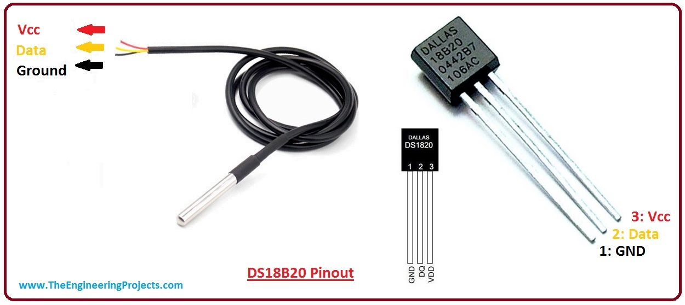

Configuring multiple DS18B20 temperature sensors using Arduino



## DS18B20

The DS18B20 communicates over a 1-Wire bus that by definition requires only one data line (and ground) for communication with a central microprocessor. In addition, the DS18B20 can derive power directly from the data line (“parasite power”), eliminating the need for an external power supply.

## Shortcomings of other examples

There are so many examples available on the internet but none of them include more than 8 DS18B20 sensors. In one of my recent projects, I had to use 16 DS18B20 sensors for monitoring temperature and save the data in a SD card. I hope my project will come handy for people who need to use two one wire bus pins simultaneously.  

<!-- ABOUT THE PROJECT -->
## About The Project

The purpose of this project was to monitor the data and save them. To monitor the temperature, DS18B20 was used and the data was saved using a SD card module by connecting it with the mainboard Arduino Mega. So, the list of components goes here:

* Arduino Mega (×1)
* DS18B20 temperature sensor (×16)
* SD card module (×1)
* SD card  (×1)
* 20×4 LCD display with i2c
* Breadboard (×1)
* Jumpers (As much as needed)

### Coding Platform

* [Arduino IDE](https://www.arduino.cc/en/software) 

<!-- GETTING STARTED -->

## Getting Started

Fork this repository or clone this to your local machine. Create a new Arduino project or import this file to existing project.  Download the below libraries from either arduino library manager or download zip from external sources.

```c+
SD.h
```

```c+
SPI.h
```

```c+
OneWire.h
```

```c+
DallasTemperature.h
```

```c+
Wire.h
```

```c+
LiquidCrystal_I2C.h
```

## Circuit  Diagram


After connecting the sensors, please check their device address using *ds18b20_serial_code* and make necessary changes in the main code. 

<!-- USAGE EXAMPLES -->

## Demonstration

https://user-images.githubusercontent.com/69699980/135725033-6f598558-f46e-47fb-9533-a5a73c4ca8fe.mp4


https://user-images.githubusercontent.com/69699980/135725041-ab3aef3c-4f99-4d5c-91a7-05e1f53b4bc7.mp4


<!-- CONTRIBUTING -->

## Contributing

Contributions are what make the open source community such an amazing place to learn, inspire, and create. Any contributions you make are **greatly appreciated**.


<!-- LICENSE -->
## License

Distributed under the MIT License. See `LICENSE` for more information.


<!-- CONTACT -->

## Contact

Sabit Shahriar Haque-  [sabitshahriarh@gmail.com](mailto:sabitshahriarh@gmail.com)

